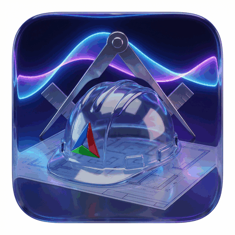
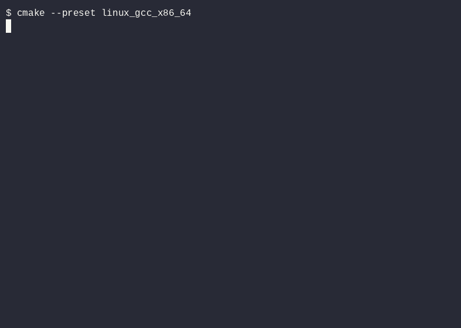
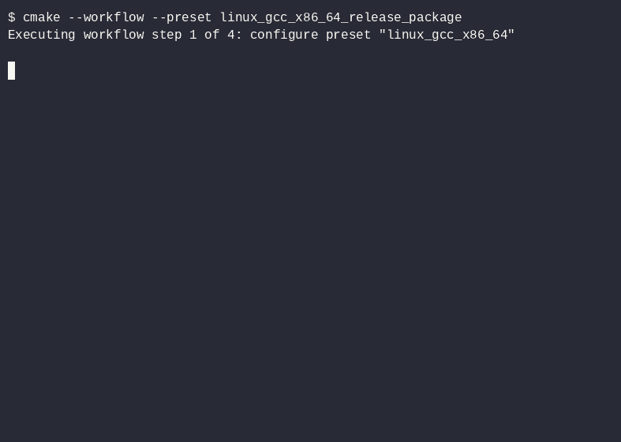

# cmake_template

<p align="center">
  
</p>

<p align="center">
  <a href="https://github.com/e-gleba/cmake_template/actions/workflows/cmake_multi_platform.yml"></a>
  <a href="https://github.com/e-gleba/cmake_template/releases"></a>
</p>

<p align="center">
  <a href="https://github.com/e-gleba/cmake_template/actions/workflows/cmake_multi_platform.yml"></a>
  <a href="https://github.com/e-gleba/cmake_template/actions/workflows/release.yml"></a>
  <a href="https://github.com/e-gleba/cmake_template/actions/workflows/docker.yml"></a>
  <a href="https://github.com/e-gleba/cmake_template/actions/workflows/publish-docker.yml"></a>
  <a href="https://github.com/e-gleba/cmake_template/actions/workflows/renovate.yml"></a>
</p>

C++23 CMake template. Ninja Multi-Config, CPM, doctest + CTest, CPack. Presets for Linux, Windows, Android, WebAssembly, and Steam Runtime.

## Quick start

```bash
cmake --preset linux_gcc_x86_64
cmake --build --preset linux_gcc_x86_64_release
ctest --preset linux_gcc_x86_64_release
```

Or replace the three steps with the `linux_gcc_x86_64_release_package` workflow preset for configure + build + test + package in one step.

## What you get

- C++23, target-based CMake, no glob, no global flags
- Dependencies via CPM, pinned tags
- Tests: doctest + CTest, JNI harness for Android
- Packaging: CPack (TGZ/ZIP/TXZ), Steampipe files for Steam builds
- Quality: clang-format, clang-tidy (native only), pre-commit

## Platforms

| Target | Configure preset | Notes |
| --- | --- | --- |
| Linux x86_64 | `linux_gcc_x86_64`, `linux_clang_x86_64` | Native, full test + package |
| Windows x86_64 | `windows_msvc_x86_64` | Native, Visual Studio 17 2022 |
| Windows cross (from Linux) | `windows_llvm_mingw_x86_64`, `_x86`, `_aarch64` | llvm-mingw toolchain, no tests |
| Android | `android_clang_aarch64`, `_armv7`, `_x86_64`, `_x86` | NDK, API 24, `c++_shared`; tests via `./gradlew connectedCheck` in `android_project/` |
| WebAssembly | `web_emscripten_wasm32` | Emscripten toolchain, SDK bootstrapped to `.emsdk/`; tests under Node.js |
| Steam | `linux_steamrt4_x86_64`, `windows_msvc_steam_x86_64`, `windows_llvm_mingw_steam_x86_64` | SteamPipe-ready ZIP, ABI/loader gates |

Release via the [release workflow](https://github.com/e-gleba/cmake_template/actions/workflows/release.yml): builds all platforms, tags, attaches artifacts.

Docker images (`fedora`, `steamos`, `alt`) are manual only: run [`docker_ci`](https://github.com/e-gleba/cmake_template/actions/workflows/docker.yml) (build + verify) or [`docker_publish`](https://github.com/e-gleba/cmake_template/actions/workflows/publish-docker.yml) (push to GHCR) — or tick `publish_docker` in a release run.

## Comparison

| Feature | **cmake_template** | [cpp-best-practices](https://github.com/cpp-best-practices/cmake_template) | [modern-cpp-template](https://github.com/filipdutescu/modern-cpp-template) | [cmake-init](https://github.com/cginternals/cmake-init) |
| --- | --- | --- | --- | --- |
| **C++ Standard** | **23 / 26** | 17 / 20 | 17 | 11+ |
| **CMake Presets** | ✅ 10+ with workflows | ❌ | ❌ | ❌ |
| **Android NDK** | ✅ 4 presets, 64-bit CI | ❌ | ❌ | ❌ |
| **Android instrumented tests** | ✅ GMD + doctest JNI | ❌ | ❌ | ❌ |
| **Linux → Windows cross** | ✅ llvm-mingw (3 arch) | ❌ | ❌ | ❌ |
| **WebAssembly** | ✅ Emscripten (SDL3 + ImGui + OpenGL demo) | ✅ + Pages deploy | ❌ | ❌ |
| **Steam Runtime / Deck** | ✅ steamrt4 + static CRT + ABI CI | ❌ | ❌ | ❌ |
| **Docker / CI** | ✅ + Actions matrix | ✅ Docker + Actions | ✅ GitHub Actions | ✅ |
| **CPack packaging** | ✅ tar.gz / zip / txz | ❌ | ❌ | ❌ |
| **Sanitizers** | ❌ [#9](https://github.com/e-gleba/cmake_template/issues/9) | ✅ ASan/UBSan | ✅ | ❌ |
| **Fuzz testing** | ❌ | ✅ libFuzzer | ❌ | ❌ |
| **Code coverage** | ❌ [#10](https://github.com/e-gleba/cmake_template/issues/10) | ✅ codecov | ✅ codecov | ❌ |
| **macOS/iOS (Xcode)** | ❌ [#20](https://github.com/e-gleba/cmake_template/issues/20) | Limited | ❌ | ❌ |
| **vcpkg** | ❌ [#3](https://github.com/e-gleba/cmake_template/issues/3) | ❌ | ❌ | ❌ |
| **License** | MIT | Unlicense | Unlicense | MIT |

## Demo

**Quick start** — configure, build, test:



**Release in one command** — `release_package` workflow with CPack:



Replayable sources and re-record instructions: [`assets/casts/`](assets/casts/readme.md).

## Layout

- `CMakeLists.txt` — top-level only: presets, tests, packaging
- `cmake/presets/` — platform presets; `cmake/toolchains/` — cross toolchains
- `cmake/cpm/` — dependency pins; `cmake/cpack/` — packaging
- `src/` — examples (`01_hello_world`, `02_sdl3_app`, …), one `CMakeLists.txt` per dir
- `tests/` — doctest suite

MIT — see [license.md](license.md).
